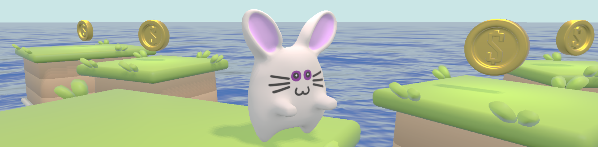

# Motor Game Engine

A game engine created as a part of computer graphics course in ITMO University.

## Features

* C# Scripting
* .GLB as scene format
* PBR support
* Audio and Physics systems
* Behaviour tree with Utility AI

## Getting Started

### Dependencies

* Either [vcpkg](https://github.com/microsoft/vcpkg) or a fresh version of [assimp](https://github.com/assimp/assimp) installed
* [Mono](https://www.mono-project.com/download/stable/)
* Visual Studio with "Game Development with C++" installed

### Executing program

1) Open and build `/Scripting/Scripting/Scripting.sln` solution
2) Open and run `computer-graphics.sln` solution

## Authors

[Dmitry Kulikov](https://github.com/W00fdev) - C# scripting and general engine architechture

[Platon Iofinov](https://github.com/elToton) - Rendering and material import

[Maxim Iakovlev](https://github.com/Utka-EmpeROR) - Behaviour Tree and Utility AI

[Nikita Kurylev](https://github.com/nikitakurylev) - .GLB import, audio and physics system
